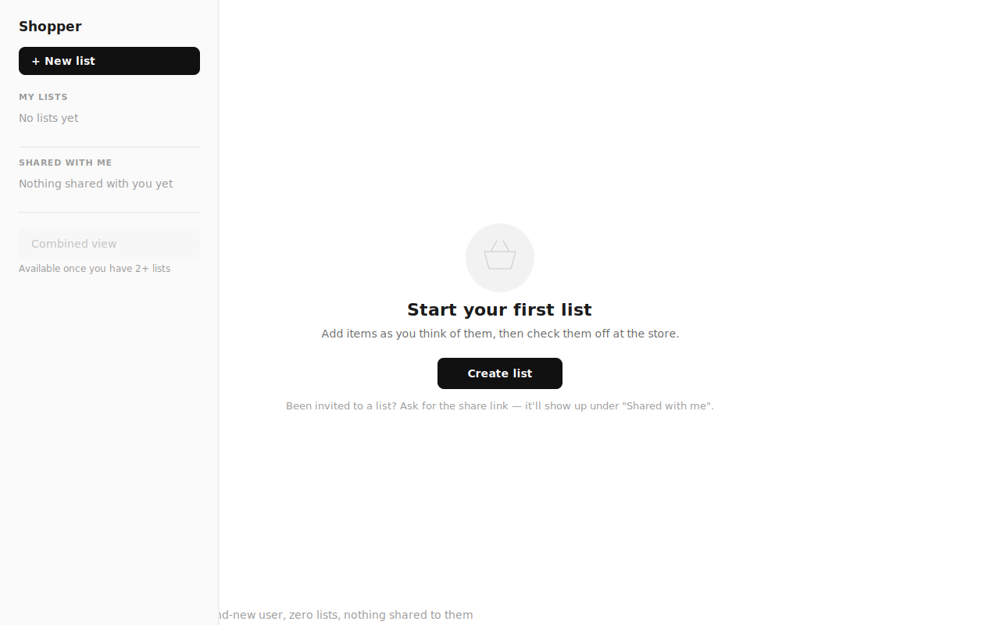
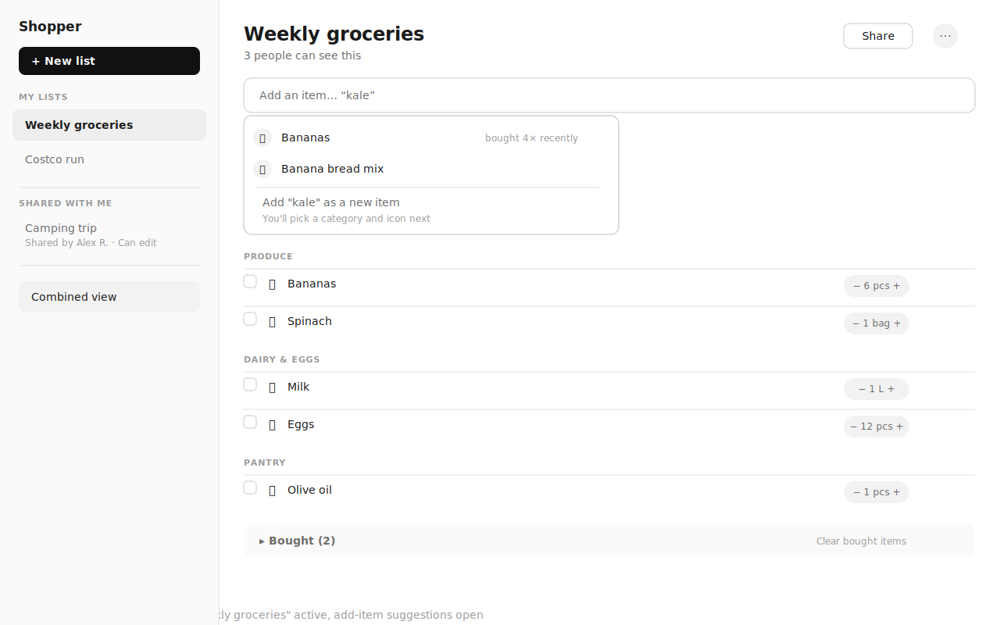
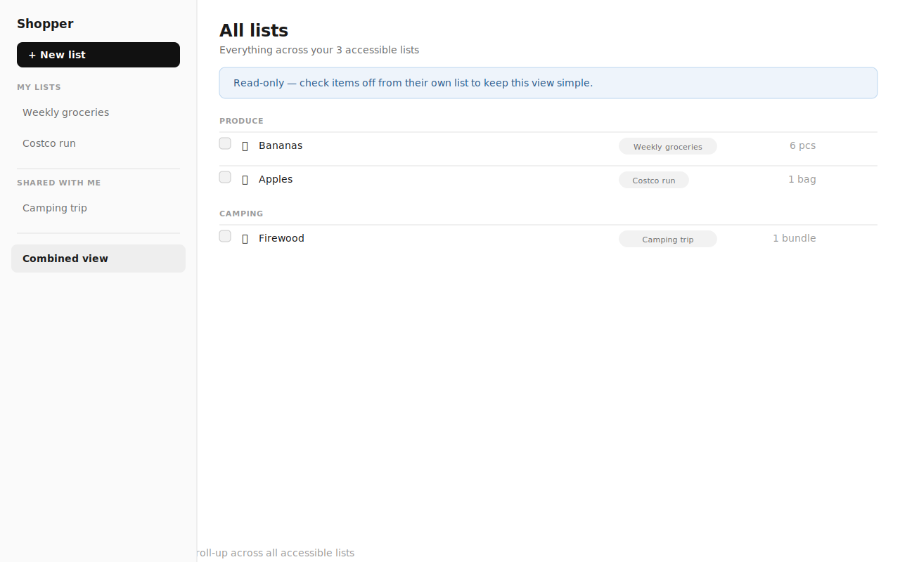
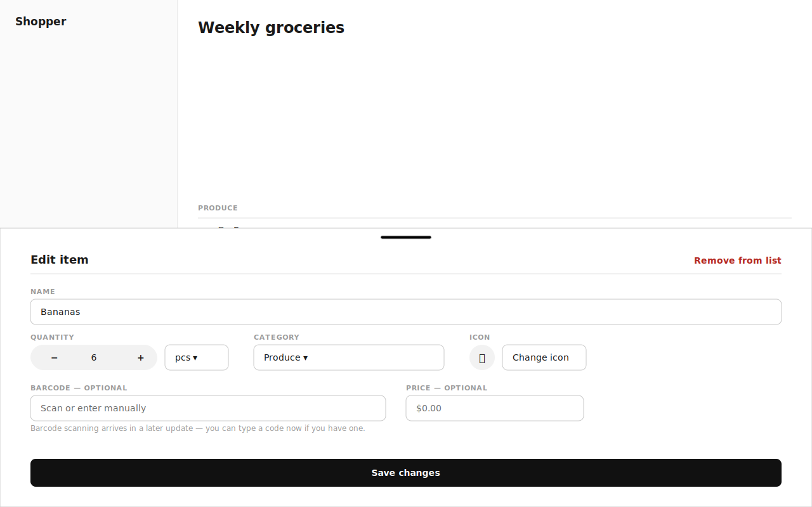
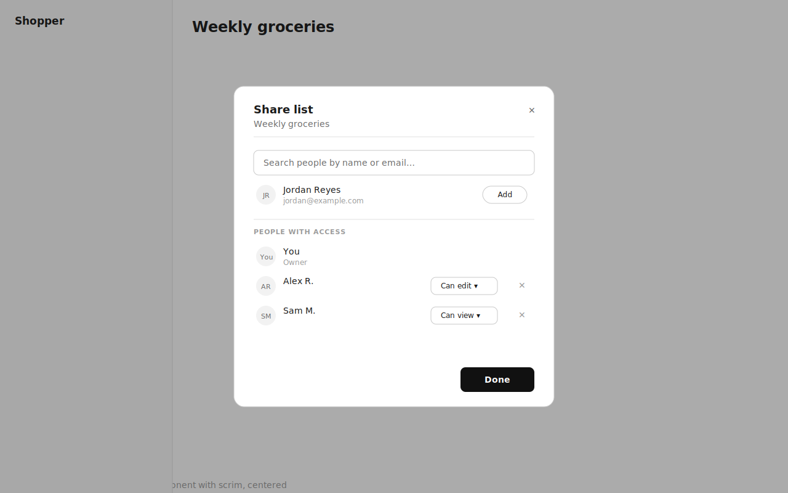
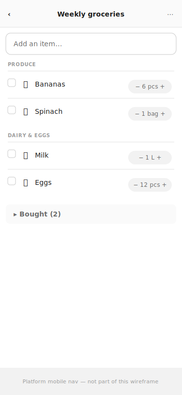
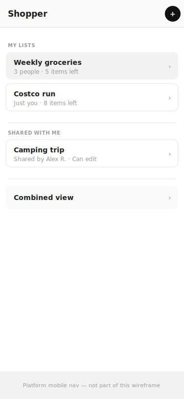
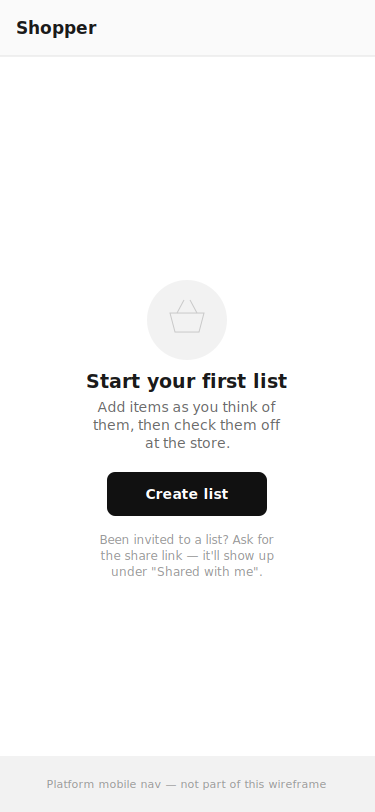
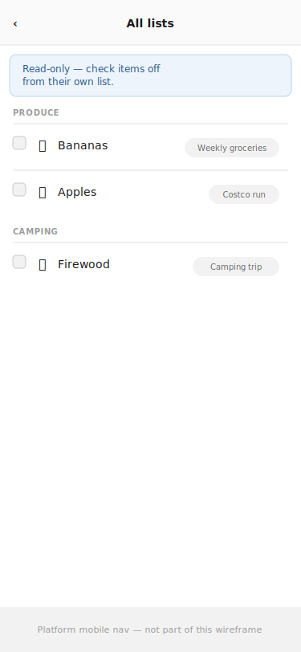
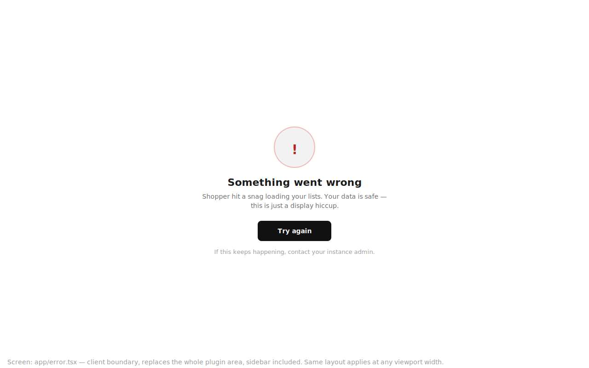

# Sovereign Shopper — Phase 1 UI (simple shared grocery list)

**Status:** Draft — for developer sign-off before implementation.\
**Scope:** `plugins/sovereign-shopper.local` Phase 1 only (roadmap T-00–T-11):
list CRUD, list switcher, add/edit items, tap-to-buy, direct per-user
sharing. Households, analytics, media, realtime, and intelligence (Phase 2+)
are out of scope for these wireframes.\
**Wireframes:** [`ui/`](ui/) (10 SVGs, referenced below).

## Problem

Shopper's SPEC and roadmap define the data and requirements, but no screen has
been laid out yet, and Phase 1 needs three new `@sovereignfs/ui` primitives
that don't exist in the design system today. Building without a shared
wireframe risks inventing four different list-row styles across the plugin
and duplicating components that should live in `packages/ui`.

## Direction

Structurally mirror **`sovereign-tasks.local`** (closest existing analog: a
collaborative, multi-list, checkable-item plugin) rather than
`sovereign-plainwrite`'s single-column dashboard: a persistent **list
switcher** (sidebar on desktop, its own screen on mobile) plus a **content
pane** for the active list. Unlike tasks, Shopper has no third detail column —
editing an item is a `Sheet` overlay, not a persistent pane, since grocery
items don't need the sustained editing tasks' descriptions do.

List-first and quiet, per SPEC's own UI section: the list screen is home,
everything else is one tap away.

## Jargon translation

| Internal term | User-facing copy |
| --- | --- |
| `shopper_list_shares` role `editor`/`viewer` | "Can edit" / "Can view" |
| `checked_at` (mark bought) | "Bought" — tap the row, no separate button |
| `shopper_products` catalog | Invisible — surfaces only as "remembers" behavior (suggestions, pre-filled category/icon on repeat adds) |
| `sdk.directory` search | "Search people by name or email…" |
| Combined view (read-only roll-up) | Same term is fine for users — but the UI must say *why* it's read-only inline (see [05](ui/03-combined-view.svg) banner copy), not just disable controls silently |
| household (Phase 2, not in these screens) | Not shown yet — Phase 1 has no household concept at all |

## Screens

### 1. Empty state — brand-new user, zero lists

First thing a new install shows. One clear action ("Create list"), plus the
line for someone who expects to be *joining* a list rather than starting one
— per the design system's empty-state rule, both audiences get an answer
without extra UI. The sidebar's "Shared with me" and "Combined view" sections
are visibly present but empty/disabled, so the user immediately understands
the shape of the app rather than discovering sections later.

### 2. List view — populated

The daily-use screen. Add-item bar shows the type-ahead suggestion dropdown
open (a **new component**, see [Engineering notes](#engineering-notes)) with
a catalog match, a related match, and an explicit "add as new item" escape
hatch — the user is never stuck if nothing matches. Items group by category
with a quantity stepper (**new component**) at the row's trailing edge; the
row itself is one continuous tap target for bought/not-bought, per SPEC
SHP-07. Bought items collapse into a single muted row rather than
cluttering the active list, with an explicit "Clear bought items" escape
hatch rather than auto-deleting silently.

### 3. Combined view

Read-only, and the wireframe states that in plain words inline (an `info`
`SystemBanner`-style strip) rather than only communicating it through
disabled checkboxes — a disabled control alone doesn't explain *why* per the
design system's degraded-state rule. Each row carries a small source-list
tag so the roll-up doesn't lose provenance.

### 4. Item edit sheet

A `Sheet` (not `Dialog`), matching `packages/ui`'s existing distinction: no
scrim, background list stays visible so the user keeps context. Barcode and
price are explicitly labeled "optional" with a one-line explanation of what's
coming later for barcode — this is progressive disclosure of a Phase 4
feature without hiding the field entirely (the SPEC data model already has
the column; showing it now avoids a schema-visible-but-UI-invisible gap).
"Remove from list" is a destructive text action, deliberately not a button,
so it doesn't compete visually with "Save changes".

### 5. Share dialog

A `Dialog` (scrim, centered, matches the existing component's mobile
auto-adapt to a full overlay — no separate mobile wireframe needed for this
screen). Search-and-add is separated from the existing-access list by a
divider so "who can I add" and "who already has access" don't blur together.
The owner's own row shows "Owner" with no controls — they can't downgrade or
remove themselves, preventing an accidental lockout.

### 6. Mobile list view

Single column, same content as screen 2 reflowed — no new interaction
pattern, confirming the responsive story is a reflow, not a rebuild. Back
chevron in the top bar returns to the list switcher (screen 7). The platform
shell's own mobile navigation is deliberately not drawn (out of this
plugin's scope) — just placeholder-labeled so it isn't mistaken for a gap.

### 7. Mobile list switcher

A dedicated screen rather than a persistent sidebar (mobile has no room for
one) — reached from the list view's back chevron, matching the tasks
plugin's mobile pattern of swapping the entire screen rather than squeezing
a sidebar into a drawer.

### 8. Mobile empty state

Reflow of screen 1 — confirms there's no new layout decision at this width,
just narrower measure and stacked copy. Same two calls to action (create vs.
"wait for a share link").

### 9. Mobile combined view

Reflow of screen 3 — the read-only banner and source-list tags survive the
narrower width unchanged; tags shrink to fit but stay legible at the
touch-target font sizes the design system requires.

### 10. Error boundary (`app/error.tsx`)

Required per the design system's error-UX convention: every plugin ships one
so an unexpected error degrades to a plugin-scoped message, never the bare
platform 500. Deliberately plain — no stack trace, no jargon — with a
one-line reassurance that data isn't lost (this is a display failure, not a
data-loss event) and a `reset()`-wired "Try again" button. This replaces the
*entire* plugin area including the sidebar, since `layout.tsx` fetches the
list switcher's data server-side — if that fetch is what failed, the sidebar
can't render either. Same layout at any viewport; no separate mobile variant
needed.

### Pages intentionally not wireframed

- **Household onboarding, invites, analytics** — Phase 2, out of scope here.

## Engineering notes

Three genuinely new `@sovereignfs/ui` primitives are needed — confirmed
against the current `packages/ui/src/components/` inventory, which has none
of these today (also already flagged in `SPEC.md`'s UI section):

1. **Checkable list row** — `Checkbox` exists but is just the control; the
   full row (checkbox + icon + label + trailing stepper, whole-row tap
   target, strikethrough-on-checked) doesn't. Build as a new
   `packages/ui` component, not plugin-local — Tasks' own item row
   (`TaskItem.tsx`) is plugin-local today and is exactly the kind of
   duplication the design system's DS-first rule warns against; worth a
   quick look at whether it should retroactively consume the new component
   too (separate conversation, not blocking Shopper).
2. **Type-ahead / suggestion input** — `Input` is a plain text field with no
   built-in async suggestion list. New component: text input + anchored
   result list (can likely reuse `Popover`'s positioning internally).
3. **Quantity stepper** — numeric input with +/− and a unit suffix. Doesn't
   exist in any form yet.

Two items are **not** new components, just usage:

- **Icon picker** — SPEC and this wireframe assume a curated set (`Icon.tsx`
  currently has ~26 generic icons, no grocery categories). Needs an actual
  icon set decision (SPEC open question 4) before `IconPicker.tsx` can be
  built — the "Change icon" button in screen 4 is a placeholder for a
  picker UI not yet designed, deliberately left unresolved here.
- **Share user-picker** — no dedicated `packages/ui` combobox exists, but
  this is expected: it's a thin `sdk.directory.searchUsers()` wrapper
  around existing `Input` + a results list, not a generic enough pattern to
  warrant its own design-system component yet (revisit if a third plugin
  needs the same thing).

No backend/platform gaps — confirmed in the prior conversation turn that
Phase 1 needs only `sdk.auth`, `sdk.db`, and `sdk.directory`, all
implemented today.

## Open questions

1. **Icon set** (SPEC open question 4) — curated grocery-category icon
   set needs sourcing/licensing before `IconPicker.tsx` is buildable. Blocks
   T-06.
2. **Quantity stepper unit list** — is the unit dropdown a fixed enum
   (pcs/kg/g/L/ml/bag/bundle/…) or free text with autocomplete from past
   entries? Wireframe assumes a fixed short list; confirm before building.
3. **New-component ownership** — do the three new primitives land in
   `packages/ui` before or alongside Shopper's Phase 1 PRs? Recommend
   building them in `packages/ui` as part of the same roadmap tasks (T-05,
   T-06) rather than a separate platform-side prerequisite, since they're
   plugin-driven and have no other consumer yet — but flag for the
   developer to confirm, since it does touch the shared design system, not
   just this plugin's repo.

## Phased plan

Each phase maps to existing roadmap tasks in
[`roadmap.md`](roadmap.md)
and is independently shippable:

1. **List CRUD + switcher shell** (T-01–T-04) — screens 1, 2 (structure
   only, no suggestions/stepper yet), 7. Ships a working list with plain
   add/remove, no polish.
2. **Add-item suggestions + stepper + icons** (T-05–T-07) — introduces the
   three new components; screen 2 fully realized.
3. **Tap-to-buy + tidy-up** (T-08–T-09) — bought-section collapse, reorder,
   group-by-category.
4. **Sharing** (T-10) — screen 5.
5. **Combined view** (T-03's roll-up + screen 3) — can ship any time after
   phase 1 once 2+ lists exist; not dependent on phases 2–4.
6. **Hardening** (T-11) — no new UI, scoping/edge-case pass across all
   screens above.

## Verification plan

Once implemented: drive each screen in the preview browser at both desktop
and 768px-and-below width, covering empty/populated/degraded states per
screen (e.g. add-item bar with zero suggestion matches, share dialog with
zero search results, combined view with only one list). Confirm every
mutation (add item, edit item, mark bought, share, revoke share) has an
inline pending label and expected-error path, not a thrown exception.
